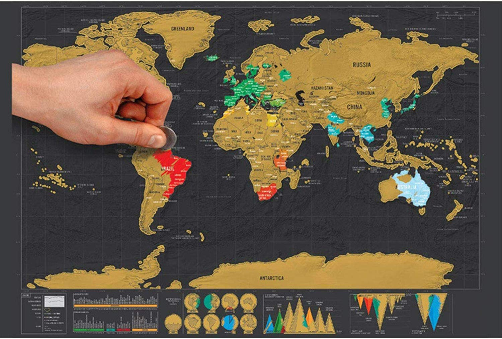
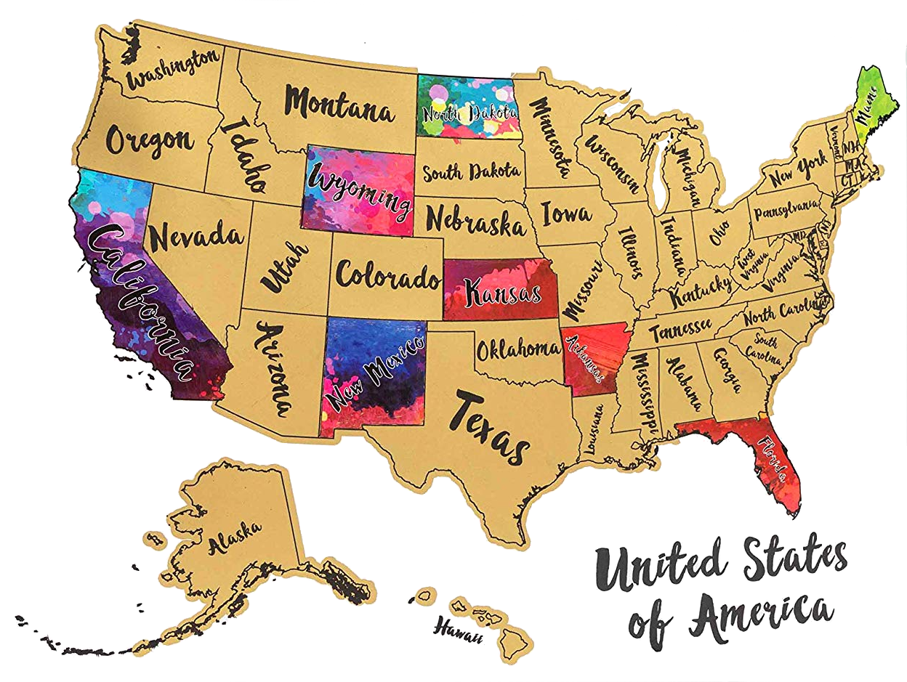

# Travel Log
## About Application
### Travel Log Application  
#### application for storing and displaying places and trips for app users

Scratch Off World Map
- scratch off countries to show your travels
- ideal conversation starter
- looks great on any smartphone
- great for kids education
- document your journey in a unique way
- good feature for any Travel agency App or BUCKET LIST App

##### From Amazon 
- IDEAL FOR THE TRAVEL ENTHUSIAST – whether you’ve got a number of countries under your belt already or you’re just setting off on a lifetime of travel plans, you need to mark your journey with our travel sized scratch off map.
- ideal for world travel and small rooms, our A3 travel sized version is perfectly portable and makes an ideal poster for a wall. It measures 42.3 x 30cm
- BEAUTIFULLY PACKAGED – our travel sized scratch world map comes in a perfectly sized tube for neat storage and easy transportation

### End User
<ul>
    <li>Me</li>
    <li>other travelers</li>
</ul>

# Architecture

## Django with React RESTFull Application

### Technologies used in this application:
<ul>
<li>Python with framework Django</li>
<li>JavaScript with libraries:</li>
</ul>
    <li>react</li>
    <li>react-router-dom</li>
</ul>
<li>HTML5 with CSS</li>
</ul>
 

#### DB Schema:

#### Component Hierarchy:

## Links related to this project:

<ul>
<li><a href="https://github.com/Silvia42/TravelLog/projects/1">Project Board</a></li>

<li><a href="https://mycodebank.herokuapp.com">Travel Log Bank on Heroku</a></li>

</ul>
 
